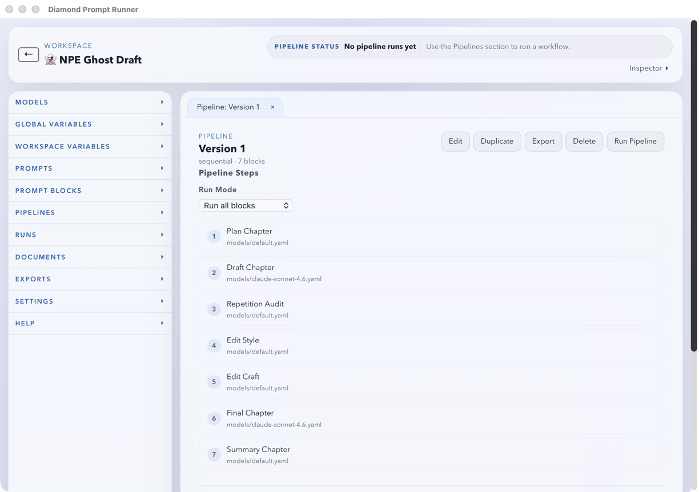

# Diamond Prompt Runner

Local-first desktop workspace for fiction prompt workflows.

Diamond Prompt Runner is a Tauri + Svelte app for authoring `.tera` prompts, running pipelines against OpenRouter, and keeping project artifacts on disk.



## Status

- Active direction: Tauri 2 desktop app with Svelte frontend
- MVP implementation slices through Plan 21 are complete
- Post-MVP and exploratory work is tracked in `implementation-plans/` and `specifications/post-mvp/`

<details open>
<summary><strong>Tech Stack</strong></summary>

- Frontend: Svelte 5, TypeScript, Vite, CodeMirror 6
- Backend: Rust, Tauri 2, Tera templating
- Testing: Vitest (frontend), `cargo test` (backend)
- Model execution: OpenRouter via direct Rust HTTP

</details>

<details open>
<summary><strong>Quick Start</strong></summary>

```bash
npm install
npm run tauri:dev
```

Dev app uses Vite on port `1420`.

</details>

<details>
<summary><strong>Common Commands</strong></summary>

```bash
# Frontend
npm run dev
npm run build
npm run typecheck
npm run lint
npm run test

# Desktop app
npm run tauri:dev

# Backend tests
cargo test --manifest-path src-tauri/Cargo.toml

# Utility scripts
npm run probe:online
npm run updater:json
```

</details>

<details>
<summary><strong>Project Structure</strong></summary>

```text
src/                    Svelte app shell, components, app state, Tauri bridge
src-tauri/              Rust backend, Tauri command surface, project store
fixtures/sample-project Canonical sample project for validation/manual checks
implementation-plans/   Slice plans and technical rollout notes
specifications/         Product and behavior specs
scripts/                Dev, release, and QA scripts
```

</details>

<details>
<summary><strong>On-Disk Project Model</strong></summary>

Each Diamond project is file-first:

```text
my-project/
├── project.json
├── documents/
├── prompts/
├── models/
├── runs/
└── exports/
```

</details>

<details>
<summary><strong>Credential Handling</strong></summary>

- Primary: native OS keychain
- Fallback: `OPENROUTER_API_KEY`
- Do not commit `.env` or secrets

</details>

<details>
<summary><strong>Key Docs</strong></summary>

- Product spec: `specifications/SPEC_DIAMOND_RUNNER_v1.md`
- Agent/runtime rules: `AGENTS.md`
- Contributor workflow: `CONTRIBUTING.md`
- Fast setup notes: `QUICKSTART.md`
- Scripts reference: `scripts/README.md`

</details>
