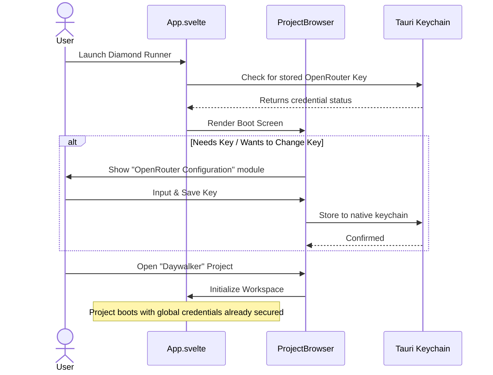
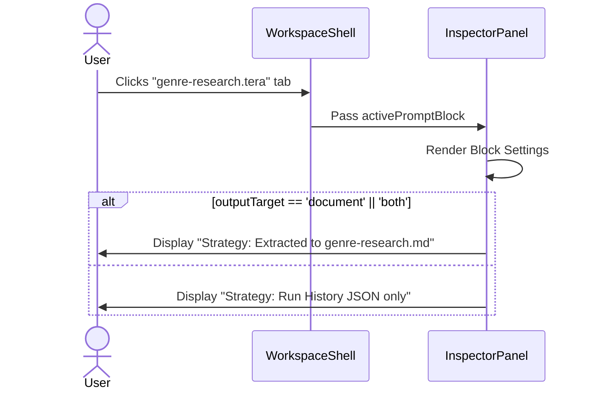

# API Key UX & Output Strategy Label (Plan 20)

## Goal
Optimize workspace UX by surfacing critical configuration boundaries exactly where the user expects them. This plan implements two specific requests:
1. Moving OpenRouter API Key configuration out from the transient `ValidationPanel` drawer and planting it cleanly on the main startup screen (`ProjectBrowser`) so it feels global.
2. Labeling the exact destination of extracted markdown files directly beneath **Block Settings** in the right-side `InspectorPanel`.

## User Review Required

> [!IMPORTANT]
> Since you are designing this in Figma, I have provided **Mermaid User Workflow Diagrams** below. You can drop these code blocks directly into Figma using a native Mermaid plugin, or use them as logic references for your layout screens!

### Diagram: Global API Key Workflow

### Diagram: Workspace Pipeline Workflow

## Proposed Changes

### Configuration Layer
#### [MODIFY] [ValidationPanel.svelte](file:///Users/carlo/diamond-runner/src/lib/components/ValidationPanel.svelte)
- Strip out the `saveKey` logic, the keychain check warnings, and the entire `div.credential-form` node tree.
- The button to execute will simply remain disabled if `!credentialState.hasStoredKey`, but the form to fix it lives permanently outside the workspace!

#### [MODIFY] [ProjectBrowser.svelte](file:///Users/carlo/diamond-runner/src/lib/components/ProjectBrowser.svelte)
- Introduce a third section underneath "New Project" and "Recent Projects" called **"Global Credentials"**.
- This section will display the user's current keychain status and provide a clear UI to Save/Clear the OpenRouter configuration so they securely authenticate before opening a workspace.

#### [MODIFY] [App.svelte](file:///Users/carlo/diamond-runner/src/App.svelte)
- Pass down the `credentialState` bindings, `saveKey`, and `clearKey` handles into `ProjectBrowser` instead of restricting them exclusively down into the `WorkspaceShell`.

### Workspace Layer
#### [MODIFY] [InspectorPanel.svelte](file:///Users/carlo/diamond-runner/src/lib/components/InspectorPanel.svelte)
- In the `.preset-section` (Block Settings), append the requested Output Label readout.
- This will deterministically display `documents/{slugified-name}.md` if configured to extract to document, otherwise display None.

## Open Questions
- Visually, would you like the "Global Credentials" card on the `ProjectBrowser` page to span full-width across the bottom, or roughly stack under the left column beneath "New Project"?

## Verification Plan
1. Boot the application and evaluate if the Project Boot screen properly reports on keychain credential state.
2. Simulate saving/clearing the API key and confirm the app state updates correctly globally.
3. Open a project workspace, navigate to an active template tab, and visually verify the right-side inspector definitively confirms what the `outputTarget` filename will be upon execution.
